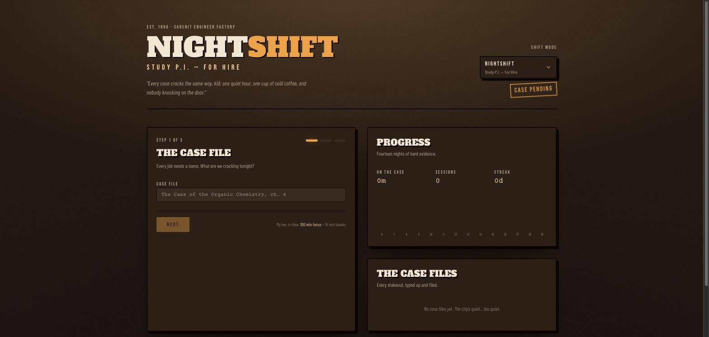

# Sarenit Timer

[](https://github.com/KamilSupera/sarenit-timer/actions/workflows/ci.yml)

A cartoon-noir Pomodoro timer. Pick a subject, set your focus/break lengths and how many sessions you're good for, then let the detective agency clock your shift. Every finished (or abandoned) case lands in a history log with streaks and a 14-day focus chart.

**No accounts, no backend, no tracking.** Config, session history and streaks live in your browser's `localStorage` and never leave the device.



## Features

- Four shift themes (Nightshift, Dayshift, Workshift, Studyshift), each with its own copy and palette
- Configurable focus/break minutes and session count, with an optional `MM:SS` delayed start
- Partial sessions are recorded when you stop early, so the log stays honest
- Stats: total focus time, sessions closed, current streak, best day, 14-day bar chart
- Everything persists locally — close the tab, come back, your streak is still there

## Tech

React 19 · TypeScript · TanStack Router · Vite · Tailwind CSS 4 · shadcn/ui (Radix) · Recharts

Pure client-side SPA. There is no server, no database and no API.

## Development

Requires Node.js 22+.

```sh
npm install
npm run dev        # http://localhost:5173
npm run lint
npm run typecheck
npm run build      # static output in dist/
npm run preview
```

## Where the data lives

| Key                     | Contents                                                                 |
| ----------------------- | ------------------------------------------------------------------------ |
| `nightshift.config.v1`  | Last used subject, session count, focus/break minutes, shift theme       |
| `nightshift.history.v1` | Last 100 sessions — date, minutes focused, sessions done, completed flag |

Clearing site data in the browser wipes both. The in-app "clear history" button wipes only the history key.

## Deployment (AWS, ~$0/month)

The build is a folder of static files, so it is served from S3 through CloudFront. CloudFront's perpetual free tier (1 TB egress and 10M requests per month) covers a portfolio site, and the S3 storage for a few MB is fractions of a cent. There is no compute to pay for.

### 1. Create the infrastructure

[`infra/site.yml`](infra/site.yml) is a single CloudFormation template: a private S3 bucket, a CloudFront distribution with Origin Access Control, and an IAM role that GitHub Actions assumes via OIDC (no long-lived AWS keys anywhere).

```sh
export AWS_REGION=eu-central-1

aws cloudformation deploy \
  --template-file infra/site.yml \
  --stack-name sarenit-timer \
  --capabilities CAPABILITY_NAMED_IAM \
  --parameter-overrides \
    GitHubRepo=KamilSupera/sarenit-timer \
    GitHubEnvironment=production \
    CreateOidcProvider=false

aws cloudformation describe-stacks --stack-name sarenit-timer \
  --query 'Stacks[0].Outputs' --output table
```

`CreateOidcProvider=false` because this account already has a `token.actions.githubusercontent.com` provider. Drop it (or pass `true`) in an account that does not.

### 2. Wire up GitHub

From the stack outputs, add repository secrets `AWS_DEPLOY_ROLE_ARN`, `AWS_S3_BUCKET`, `AWS_CLOUDFRONT_DISTRIBUTION_ID`, and repository variables `AWS_REGION` (`eu-central-1`) and `SITE_URL`.

Nothing here is a credential — the role ARN is only usable by a workflow running on this repository's `main` branch, and the bucket is unreachable except through CloudFront. They are secrets rather than variables so the deploy logs do not advertise the infrastructure.

### 3. Push

[`.github/workflows/deploy.yml`](.github/workflows/deploy.yml) builds on every push to `main`, syncs `dist/` to S3 (hashed assets get a one-year immutable cache, everything else five minutes) and invalidates the distribution.

### Custom domain

Not wired up. To add one: request an ACM certificate in `us-east-1`, then add `Aliases` and `ViewerCertificate` to the distribution in `infra/site.yml` and point a DNS ALIAS/CNAME at the CloudFront domain. A Route 53 hosted zone is $0.50/month; an external DNS provider is free.

## Security

This is a public repository with a deploy pipeline attached to a real AWS account, so the split between trusted and untrusted CI matters.

**No long-lived credentials exist anywhere.** GitHub Actions authenticates to AWS with OIDC. The role's trust policy is pinned to `repo:<owner>/<repo>:environment:production`, so only a job that declares that environment can assume it — a fork cannot, and neither can any workflow that skips the environment. Which branches may reach the environment, and whether a human has to approve first, are enforced by the environment's own protection rules rather than by IAM. The role's permissions grant exactly three things: write objects into the one site bucket, list that bucket, and invalidate the one distribution. Nothing else in the account is reachable from CI.

**Fork pull requests run untrusted code.** `ci.yml` therefore declares `permissions: contents: read`, holds no secrets, checks out with `persist-credentials: false` so the job cannot reuse the checkout token, and installs with `npm ci --ignore-scripts` so a pull request cannot execute a `postinstall` hook on the runner. Deployment lives in a separate workflow that only triggers on pushes to `main`.

**Third-party actions are pinned to full commit SHAs**, since tags are mutable and a compromised tag would otherwise run inside a job that holds AWS credentials. Dependabot keeps the pins current.

The app itself has no server, no API and no telemetry, so there is no runtime attack surface beyond the static files.

### Repository settings to match

A few controls live in GitHub's UI rather than in this repo, and are worth setting on any public fork of this pipeline:

- **Actions → General → Fork pull request workflows**: require approval for all outside collaborators
- **Actions → General → Workflow permissions**: read-only `GITHUB_TOKEN` by default
- **Environments → `production`**: add required reviewers and restrict it to the `main` branch — this is what confines AWS access to `main`, since the OIDC subject names the environment rather than the branch
- **Code security**: enable secret scanning and push protection (free on public repositories)
- **Branches**: protect `main` — require the `ci` check to pass before merge

## License

MIT — see [LICENSE](LICENSE).
